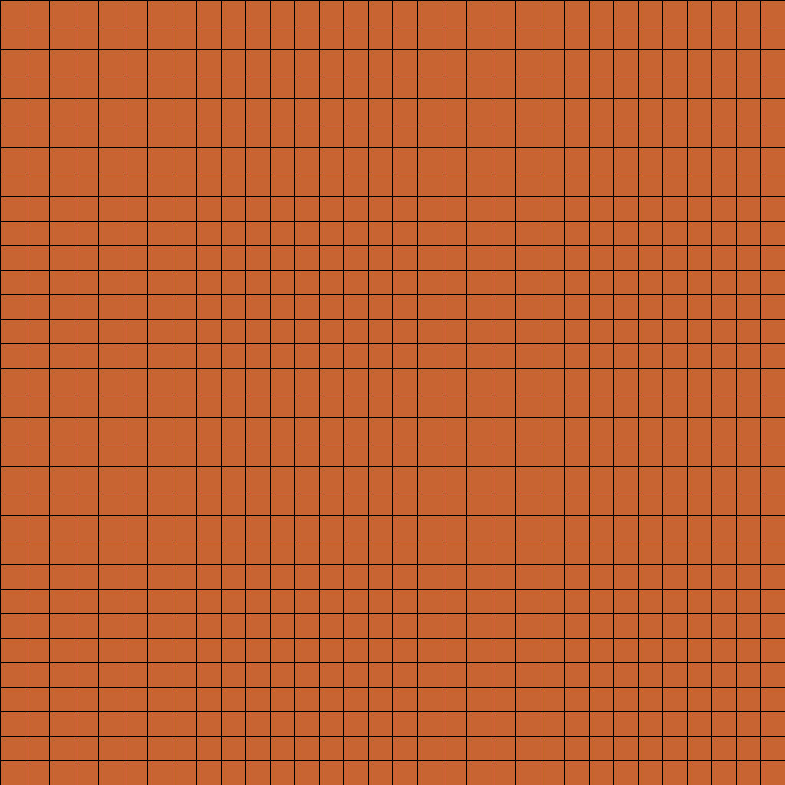

<p align="center">
  
</p>

<h1 align="center">Not2Pix</h1>

<p align="center">
  <strong>A fast, cross-platform pixel art editor built with libGDX</strong>
</p>

<p align="center">
  
  
  
  
</p>

---

## ✨ Features

- 🎨 **Multi-tool drawing** — Pencil, Eraser, Fill bucket, Line, Rectangle, and Shape tools
- 📐 **Selection tool** — Select, move, and manipulate regions
- 🖼️ **Layer support** — Multiple layers with visibility and opacity controls
- 🎞️ **Frame animation** — Create sprite animations with frame-by-frame editing
- 🎁 **GIF export** — Export animations as animated GIFs
- 📂 **Aseprite format** — Read and write `.ase` files for interoperability
- 🗺️ **Minimap & zoom** — Navigate large canvases with up to 128x zoom
- 🎛️ **HSV color picker** — Full-featured color selection with palette management
- 🔗 **NotTiled integration** — Edit tilesets directly from [NotTiled](https://github.com/AidanMirwanda) via intents
- ↩️ **Undo/Redo** — Full undo history for non-destructive editing
- 📱 **Touch-optimized** — Gesture support for pan, zoom, and drawing on mobile

## 🏗️ Project Structure

```
Not2Pix/
├── core/          # Shared editor logic (tools, UI, document model)
├── android/       # Android launcher & platform integration
├── desktop/       # Desktop (LWJGL3) launcher
├── gradle/        # Gradle wrapper
├── build_debug.sh # Build debug APK
└── deploy_to_phone.sh  # Build + install + launch on device
```

## 🚀 Getting Started

### Prerequisites

- **JDK 17** (OpenJDK recommended)
- **Android SDK** with build-tools 34.0.0 and API 34
- **ADB** (for device deployment)

### Build Debug APK

```bash
./build_debug.sh
```

The APK will be at `out/Not2Pix_debug.apk`.

### Build & Deploy to Device

```bash
./deploy_to_phone.sh
```

This builds, installs, and launches Not2Pix on all connected devices.

### Run on Desktop

```bash
./gradlew :desktop:run
```

## 🛠️ Tools

| Tool | Description |
|------|-------------|
| Pencil | Draw individual pixels with configurable brush size |
| Eraser | Erase to transparency |
| Fill | Flood-fill bounded areas |
| Line | Draw pixel-perfect lines |
| Rectangle | Draw rectangles (filled or outline) |
| Shape | Draw various shapes |
| Selection | Select, move, and copy regions |

## 📋 Supported Formats

| Format | Read | Write |
|--------|------|-------|
| PNG | ✅ | ✅ |
| BMP | ✅ | — |
| Aseprite (.ase) | ✅ | ✅ |
| GIF (animated) | — | ✅ |

## 🤝 Integration with NotTiled

Not2Pix can be launched directly from NotTiled to edit tilesets. It accepts `EDIT` and `VIEW` intents for PNG/BMP images, and exposes a custom `com.mirwanda.not2pix.EDIT_TILESET` action for seamless round-trip editing.

## 📄 License

This project is licensed under the **GNU General Public License v3.0** — see the [LICENSE](LICENSE) file for details.

---

<p align="center">
  Made with ☕ and pixels
</p>
